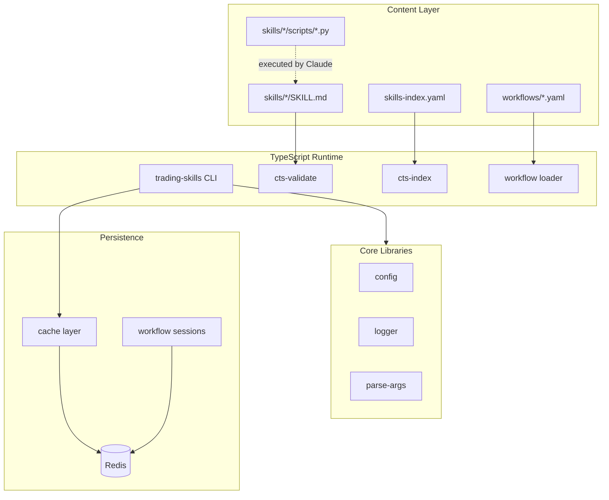
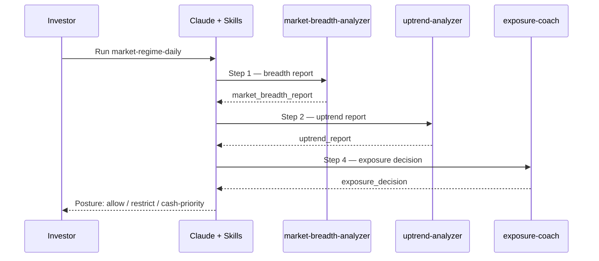

# Claude Trading Skills Platform

A production-ready toolkit for structured equity investing and swing trading workflows. Combines **62 Claude Skills** (markdown + Python scripts) with a **TypeScript CLI platform** and optional **Redis-backed persistence** for metadata caching and workflow session state.

Built for time-constrained individual investors who want disciplined market review, risk management, trade planning, and journaling — not automated buy/sell signals.

> **Disclaimer:** Educational and research purposes only. Not financial advice. Trading involves risk of loss. All decisions are yours.

---

## Feature Highlights

| Capability | Description |
|------------|-------------|
| **62 Trading Skills** | Market regime, portfolio review, swing screening, trade memory, strategy research |
| **Workflow Manifests** | Declarative YAML pipelines with decision gates and artifact tracking |
| **Unified CLI** | Cross-platform `trading-skills` command for validation, listing, and navigation |
| **Redis Persistence** | Optional cache for skill metadata and workflow session state |
| **Strict TypeScript** | Typed platform layer with ESLint, Vitest, and CI-ready validation |
| **Python Analytics** | Screeners, calculators, and report generators preserved from upstream |
| **Metadata Validation** | Bijection checks between `skills-index.yaml` and `skills/` folders |

---

## Architecture



### Daily Market Regime Workflow



Human decision gates remain central — the workflow produces posture recommendations, not trade directives.

---

## Project Structure

```
claude-trading-skills/
├── src/                    # TypeScript platform (strict mode)
│   ├── cli.ts              # Unified CLI entry point
│   ├── config/             # Environment configuration (Zod)
│   ├── lib/                # Logger, Redis, CLI utilities
│   ├── skills/             # SKILL.md + index validation
│   └── workflows/          # Workflow loader
├── skills/                 # 62 Claude Skills (content + Python scripts)
├── workflows/              # 9 operational workflow manifests
├── skillsets/              # Install bundles (market-regime, core-portfolio, etc.)
├── skills-index.yaml       # Canonical skill registry
├── scripts/                # Python automation (packaging, codegen, drift checks)
├── tests/                  # Vitest unit tests
├── docs/                   # Engineering documentation
└── pyproject.toml          # Python dependencies for skill scripts
```

See [docs/STRUCTURE.md](docs/STRUCTURE.md) for design decisions.

---

## Installation

### Prerequisites

- **Node.js 18+** — TypeScript CLI platform
- **Python 3.9+** — Skill script execution (screeners, calculators)
- **Redis 6+** (optional) — Metadata caching and session persistence

### Setup

```bash
git clone https://github.com/tradermonty/claude-trading-skills.git
cd claude-trading-skills
npm install
cp .env.example .env
npm run build
```

### Python skill scripts (optional)

```bash
pip install -e ".[dev]"
# or: uv sync --extra dev
```

### Use with Claude

**Web App:** Upload `.skill` packages from `skill-packages/` (build with `python scripts/package_skills.py`).

**Claude Code:** Copy skill folders from `skills/` into your Skills directory.

---

## Configuration

Copy `.env.example` to `.env`:

| Variable | Default | Description |
|----------|---------|-------------|
| `LOG_LEVEL` | `info` | Logging verbosity |
| `REDIS_ENABLED` | `true` | Set `false` to disable Redis |
| `REDIS_URL` | `redis://127.0.0.1:6379` | Redis connection URL |
| `REDIS_KEY_PREFIX` | `cts:` | Key namespace prefix |
| `REDIS_CACHE_TTL_SECONDS` | `600` | Metadata cache TTL |
| `SKILLS_DIR` | `skills` | Skills directory path |
| `SKILLS_INDEX_PATH` | `skills-index.yaml` | Index file path |
| `WORKFLOWS_DIR` | `workflows` | Workflow manifests directory |

Python skill API keys (`FMP_API_KEY`, `ALPACA_API_KEY`, etc.) are read by individual skill scripts.

---

## Development

```bash
npm run dev          # Watch mode (tsup)
npm run typecheck    # TypeScript strict check
npm run lint         # ESLint
npm run test         # Vitest unit tests
npm run validate     # Full pipeline: typecheck + lint + test + build
```

### CLI usage

```bash
npx trading-skills list
npx trading-skills workflows
npx trading-skills workflow market-regime-daily
npx trading-skills validate
npx trading-skills validate-index --strict-workflows
npx trading-skills status
```

### Skill maintenance

```bash
npm run validate-skills   # Audit all SKILL.md frontmatter
npm run validate-index    # Validate skills-index.yaml bijection
```

### Python tests

```bash
pytest                    # All skill tests (importlib mode)
bash scripts/run_all_tests.sh   # Per-skill isolation (pre-push)
```

---

## Testing

| Suite | Command | Scope |
|-------|---------|-------|
| TypeScript unit tests | `npm test` | Config, validation, Redis manager, workflows |
| TypeScript full pipeline | `npm run validate` | Typecheck + lint + test + build |
| Python skill tests | `pytest` | Screener logic, calculators, scorers |

Tests cover argument parsing, configuration loading, skill discovery, index validation, workflow loading, Redis connection management, and cache key generation.

---

## Recommended Workflows

| Goal | Workflow | Key Skills |
|------|----------|------------|
| 15-min daily market check | `market-regime-daily` | market-breadth-analyzer, uptrend-analyzer, exposure-coach |
| Weekly portfolio review | `core-portfolio-weekly` | portfolio-manager, kanchi-dividend-review-monitor |
| Swing candidate screening | `swing-opportunity-daily` | vcp-screener, technical-analyst, position-sizer |
| Trade journaling loop | `trade-memory-loop` | trader-memory-core, signal-postmortem |
| Monthly performance review | `monthly-performance-review` | trader-memory-core, backtest-expert |

Canonical source: [`workflows/*.yaml`](workflows/) and [`skills-index.yaml`](skills-index.yaml).

---

## Troubleshooting

### Redis connection fails

Set `REDIS_ENABLED=false` in `.env` for local development without Redis. The CLI operates without caching when Redis is disabled.

### Python skill script import errors

Install dev dependencies: `pip install -e ".[dev]"`. Some skills require optional packages (`beautifulsoup4`, `statsmodels`, `pandas`).

### Index validation errors

Run `npx trading-skills validate-index --strict-workflows` for detailed error codes (IDX001–IDX010, WF001). Ensure every folder in `skills/` has a matching entry in `skills-index.yaml`.

### Build errors after Node upgrade

Delete `node_modules/` and `dist/`, then `npm install && npm run build`.

### SKILL.md validation warnings

Long skill files (>500 lines) generate warnings. Consider moving reference material to `references/` subdirectory.

---

## Contributing

1. Fork the repository and create a feature branch.
2. Run `npm run validate` before submitting.
3. For skill changes, update `skills-index.yaml` and run both validators.
4. Follow existing naming conventions (`kebab-case` skill ids).
5. Python skill scripts: match surrounding code style; add tests in `scripts/tests/`.
6. TypeScript platform: strict mode, no unused exports, ESLint clean.

See [CLAUDE.md](CLAUDE.md) for detailed contributor guidelines and [docs/AUDIT.md](docs/AUDIT.md) for architecture notes.

---

## FAQ

**Is this an automated trading bot?**
No. Skills produce analysis, reports, and posture recommendations. Human decision gates are built into every workflow.

**Do I need API keys?**
Many skills work without paid APIs (public CSVs, local calculation). FMP, FINVIZ, and Alpaca keys unlock screener and portfolio features. See each skill's `integrations:` entry in `skills-index.yaml`.

**Why both Python and TypeScript?**
Python skill scripts handle financial computation (screeners, scorers). TypeScript provides cross-platform CLI tooling, validation, and optional Redis caching.

**Can I use this without Redis?**
Yes. Set `REDIS_ENABLED=false`. All validation and listing commands work without a Redis server.

**What is the canonical skill list?**
[`skills-index.yaml`](skills-index.yaml). If README, docs, or CLAUDE.md disagree with the index, the index wins.

**How do I package skills for Claude Web App?**
`python scripts/package_skills.py --skill <skill-name>` generates `.skill` ZIP archives.

---

## License

MIT — see [LICENSE](LICENSE).

---

## Related Resources

- [Metadata & Workflow Schema](docs/dev/metadata-and-workflow-schema.md)
- [Project Vision](PROJECT_VISION.md)
- [Hermes Trading Research Agent Work Package](https://github.com/tradermonty/hermes-trading-research-agent-work-package)
